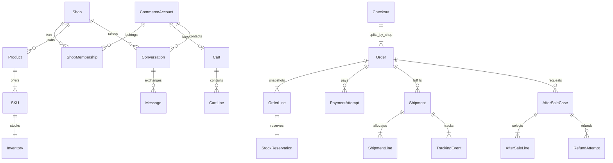

# 领域与数据关系

所有实体/表名是新平台**目标模型**，不是已有表。版本 commerce-v1。
UUID由服务器生成；时间UTC；写入实体带正整数version、created_at、updated_at。
字段的null/空列表按本页区分；历史快照和业务事件不可通过通用更新接口重写。
金额字段为0或正整数minor（不接受bool/小数），currency固定CNY。

## 目标关系图

图只展示主要关系；Case/Shipment中的行还必须与同Order行匹配，不能仅依赖上述图示外键。

## 身份、商品与库存

| 实体 | 关键字段与关系 | 约束 |
| --- | --- | --- |
| CommerceAccount | id、username、password_hash、active、customer_enabled、demo_enabled | username按小写ASCII唯一；能力不是前端role参数 |
| CommerceSession | account_id、token_digest、expires_at、revoked_at | 不透明Bearer，8小时，只有摘要持久化；独立于旧AuthSession |
| Shop | id、name、status ACTIVE/SUSPENDED | 演示Seed建店；暂停店铺不允许新下单/上架，仍处理已有订单 |
| ShopMembership | shop_id、account_id、role OWNER/STAFF、active | 同一店铺/账号唯一；一个人可在多店任职；不授予客户身份 |
| Product | shop_id、title、description、status DRAFT/PUBLISHED/ARCHIVED | 仅PUBLISHED且店铺ACTIVE可购买；历史引用不删除 |
| SKU | product_id、sku_code、options、unit_price_minor、price_version、active | sku_code店铺内唯一；金额1..100000000；options纯键值字符串 |
| Inventory | sku_id、on_hand、reserved、version | 非负整数；reserved≤on_hand；available=on_hand-reserved |
| StockMovement | sku_id、on_hand_delta、reserved_delta、reason、related_record_id、actor_id | 追加记录；两个delta表达账面/占用变化，支付/回库/调整可追溯 |
| Cart / CartLine | customer_id；sku_id、quantity、seen_price_version、seen_price_minor | 每客户1个Cart，每SKU1行；数量1..99；最多50行 |

Product只组织展示，购买/库存以SKU为单位。价格版本只在价格变更时增加；上/下架和
库存变化不能伪造价格确认。购物车不预留、不保证有货；看到的价版本保留供提交校验。
库存on_hand指平台账面未售出数量；付款即扣减，发货不能再扣一次。
账号/店铺停用不是删除历史，当前权限每次重新检查。首次交付采用显式演示Seed，不开放
注册、店铺入驻、成员管理、密码重置或支付账户管理接口；不是正式经营账号体系。

## 订单与付款

| 实体 | 关键字段与关系 | 约束 |
| --- | --- | --- |
| Checkout | customer_id、cart_id、source_cart_version、result_cart_version、order_ids | 一个提交可产生多店Order；成功事务清空已购买Cart；不维护统一支付状态 |
| Order | checkout_id、customer_id、shop_id、status、financial_status、currency、total_minor、payment_deadline、address_snapshot、cancel_reason_code、cancelled_at、version | 每单仅一家店铺；付款期限创建后15分钟；商品/运费/税费组成总额 |
| OrderLine | order_id、sku_id、product_title_snapshot、options_snapshot、unit_price_minor、quantity、refunded_unshipped_qty、refunded_shipped_qty | 数量/快照不随商品改价变化；两类退款数量不能重叠 |
| StockReservation | order_line_id、quantity、state HELD/CONSUMED/RELEASED | 每行一次预留；支付全单CONSUMED；过期/未付取消全单RELEASED |
| PaymentAttempt | order_id、amount_minor、currency、state PENDING/SUCCEEDED/FAILED、simulation、provider_reference | 金额等于全单总额；每单最多一个PENDING；最多一次成功 |
| RefundAttempt | after_sale_id、amount_minor、state PENDING/SUCCEEDED/FAILED、simulation、provider_reference | 每Case最多一个PENDING和一次成功；累积成功退款≤成功付款 |

`total_minor=sum(unit_price_minor×quantity)`，运费和税费字段都固定0；无优惠、浮点金额或
“客户端总价可信”的路径。客户与商家读到同一订单事实的授权视图，商家没有跨店Checkout视图。
地址为订单私有快照：recipient_name(1..100)、phone(1..32)、country_code固定CN、
region/city(1..100)、postal_code(1..20)、address_line(1..300)，均trim后非空。
不存真实客户数据；不提供个人地址簿。未发货地址变更产生追加revision及Order.version；
原checkout地址和历史revision仍保留，最新授权视图用当前revision。

## 包裹、消息与售后

| 实体 | 关键字段与关系 | 约束 |
| --- | --- | --- |
| Shipment | order_id、tracking_number、status、simulation、shipped_at、delivered_at | 仅同店已付款订单；tracking_number由模拟适配器生成，全局唯一 |
| ShipmentLine | shipment_id、order_line_id、quantity | 同订单且数量正；累计发货量≤购买量-未发退款量 |
| TrackingEvent | shipment_id、event_id、occurred_at、kind、description、source | event_id唯一、不可改写；事件来源模拟，无伪造实际承运商 |
| Conversation | customer_id、shop_id、order_id可null | 唯一(customer,shop,order-or-general)；指定Order必须属该客户和店铺 |
| Message | conversation_id、sender_account_id、sender_side CUSTOMER/MERCHANT、body、created_at | 内容1..2000字trim后非空；追加记录；不重写/删除/携带HTML |
| AfterSaleCase | order_id、type UNSHIPPED_REFUND/RETURN_REFUND、state、reason、requested_amount_minor、version | 每订单最多1个非终态Case；客户申请，店铺OWNER决定 |
| AfterSaleLine | case_id、order_line_id、quantity、unit_price_minor_snapshot | 仅一类未发/已送达数量；不能超过对应可退款数量；金额服务器计算 |
| ReturnShipment | case_id、tracking_number、state IN_TRANSIT/RECEIVED、restock | 每退货Case最多1个；商家确认全部申请数量收货，再选择是否回库 |
| BusinessAudit | actor_id、action、target_id、request_id、safe_metadata、created_at | 包含允许/拒绝与失败；无密码、令牌、地址或消息原文 |
| IdempotencyRecord | actor_id、operation、key、request_hash、resource_ids、response_status、response_payload | 成功事务同提交；绑定原结果；所有权/会话失效不可通过重放绕过 |

Shipment状态和Order财务/履约状态彼此独立。退货包裹不是出库Shipment，不改写原配送时间线。
退款对历史发货量不作减法：退款未发量和退款已发量分别累计。活动售后锁住申请数量；
终态Case保留，不代表可再次退款。returned/rejected/cancelled历史不能靠新增Case重复回款。

## 数据所有权与兼容

平台PostgreSQL拥有上述记录，按领域新增表与迁移。现有users/teams/inquiries及Provider
快照保持旧语义。新会话不接受旧Bearer；旧会话不接受CommerceBearer。共享Argon2id、
Clock、HTTP基础设施，不共享隐式权限或Seed角色。
Product/Order不硬删除；购物车行可删除；消息、事件、支付、库存流水和审计只追加。
Seed包含全虚构客户/店铺/商品，必须显式development/test且不覆盖现有数据。
数据库FK/唯一/CHECK约束和服务端事务共同验证同Order/Shop归属；仅有UUID外键不够。
