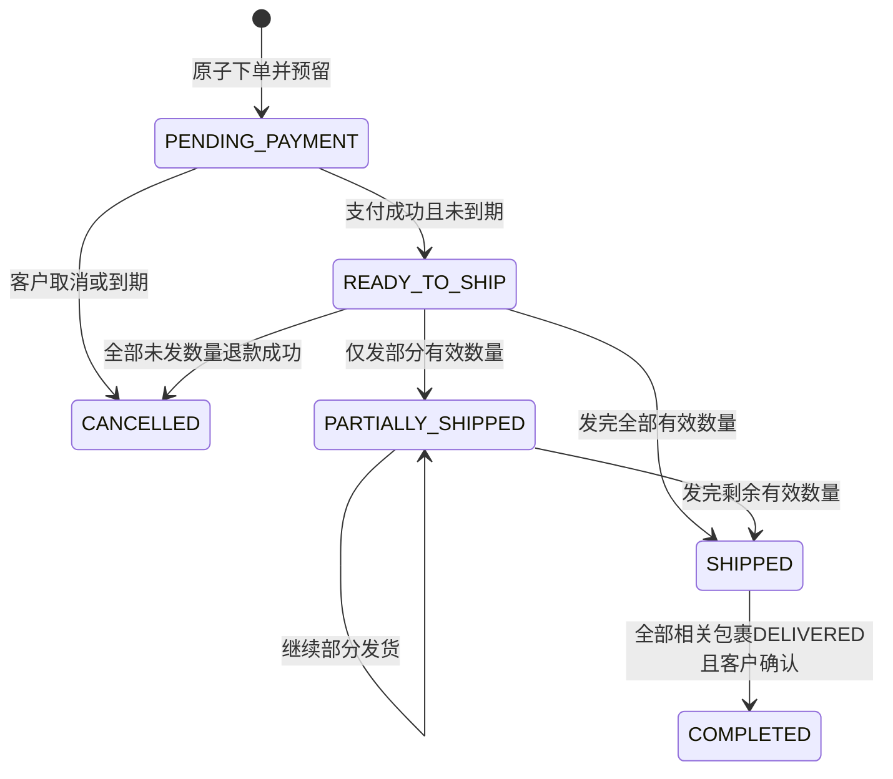
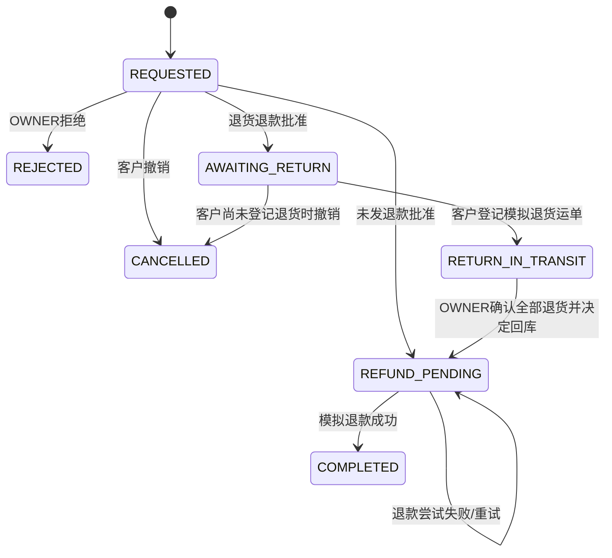

# 状态、库存与事务规则

版本 commerce-v1。所有规则是未来实现的硬约束。Clock注入，时间UTC；精确边界包含
相等时刻。客户端不能直接PATCH状态或自行指定支付金额、库存占用、退款金额。

## 1. 商品、价格与购物车

Product DRAFT→PUBLISHED→ARCHIVED；ARCHIVED可重新PUBLISHED；已上架商品可修改描述/
标题/价格，但不能改变SKU含义/删除被订单引用的SKU。上架要求active SKU且价格有效，
库存0允许展示缺货；暂停店铺不得上架。停售不撤销既有订单或其快照。

客户Cart写入SKU与quantity及明确的seen_price_version。服务器必须确认该版本等于当前；
不相等返回409 PRICE_CHANGED与当前公开价格/版本，不自动更新Cart。客户端重新展示价格，
客户再次明确操作后可更新。描述变更不导致价格冲突；下架/停店/缺货在checkout重新校验。

Checkout锁Cart及相关业务记录，验证全部行的可售性、价格、库存与地址。任一失败整个
购买不创建Order/Reservation、不清Cart。成功按shop拆单，每单按当前价格保存快照，
创建HELD预留和15分钟deadline，清空Cart、version增加，返回Checkout及Order IDs。
没有跨店“总付款”：每单单独付款，一店付款失败不影响另一店已成功的订单。

## 2. 库存守恒

| 事件 | on_hand变化 | reserved变化 | Reservation |
| --- | --- | --- | --- |
| 下单预留q | 0 | +q | HELD |
| 全单支付成功 | -q | -q | HELD→CONSUMED |
| 未付取消/支付期限到达 | 0 | -q | HELD→RELEASED |
| 发货 | 0 | 0 | 不变；已经付款扣减 |
| 未发退款成功q | +q | 0 | 不复活预留；追加退款回库流水 |
| 退货确认且restock=true | +q | 0 | 独立追加退货回库流水 |
| 退货退款成功 | 0 | 0 | 不二次回库 |
| OWNER人工增减库存delta | +delta | 0 | 调整后on_hand≥reserved且≥0 |

下单/付款/取消涉及所有行，全事务成功；StockMovement与业务结果同提交。
最后一件并发购买仅一方成功，不能把检查与写入拆成无锁两步。下单先结算涉及SKU的
已到期未付订单（释放该订单全部预留），再检查库存；不只释放其中一行。
到期使用now≥payment_deadline。读取不写库，读视图返回payment_expired与payment_deadline；
payment_expired仅当status=PENDING_PAYMENT且now≥payment_deadline为true（已付/已取消为false）。
显式demo过期结算和购买/支付/取消写入会结算到期记录。没有承诺后台定时器已实现。
支付尝试PENDING不延长库存期限；到期未付即释放并使PENDING尝试FAILED/ORDER_EXPIRED。

## 3. Order与财务是独立状态

状态是持久化、规则校验后更新。付款deadline到期拒绝付款并提交过期结算；同一秒
付款/过期并发由Order锁后Clock决定胜者，不允许晚到结果复活已取消订单。
财务status独立：UNPAID→PAID→PARTIALLY_REFUNDED→REFUNDED；第一笔退款恰好全额则
PAID→REFUNDED。成功付款和成功退款金额计算该状态；失败尝试不改变它。

累计发货量=全部ShipmentLine quantity；有效履约量=购买量-refunded_unshipped_qty。
每行发货量≤有效履约量。部分未发退款完成后重新计算：全部有效量已发则Order变SHIPPED；
全部有效量0且未发则CANCELLED。PARTIALLY_SHIPPED可因未发退款完成直接变SHIPPED。
发后全额退货退款不会把SHIPPED/COMPLETED改成CANCELLED，历史履约仍然发生过。
未发退款回库不重复释放已CONSUMED预留。已付款“取消”通过UNSHIPPED_REFUND而非cancel API。
Order COMPLETED后仍允许符合窗口的退货退款，保持原完成时间。
CANCELLED同时记录cancelled_at和cancel_reason_code：CUSTOMER_CANCELLED、ORDER_EXPIRED或
ALL_UNSHIPPED_REFUNDED；其他状态两字段null。退款后不逆转已COMPLETED的履约状态。

地址仅客户修改：PENDING_PAYMENT且未到期，或READY_TO_SHIP且没有任何Shipment/活动Case。
只允许上述两种状态，部分发货后不能更改地址，商家不能静默替客户修改。
确认收货要求SHIPPED、全部正向Shipment DELIVERED且没有活动Case。不自动确认收货。

## 4. 支付与退款尝试

PaymentAttempt PENDING→SUCCEEDED或FAILED；失败后客户可创建新的PENDING，仍需未到期、
Order PENDING_PAYMENT。每单最多一次成功；尝试金额来自Order，不接受客户端金额。
DEMO结果也必须校验当前尝试、订单前态、期限、关联及版本，结果处理与库存/审计原子提交。
已终态Attempt不得写另一种结果；重复同一结果只重放，不再扣减。

RefundAttempt同样PENDING→SUCCEEDED/FAILED。只有OWNER可从Case REFUND_PENDING创建；
金额来自Case。失败保留Case REFUND_PENDING，OWNER可重新发起新尝试，不要求客户新建Case。
成功后Case COMPLETED、对应退款数量/财务和未发回库同事务。累计退款不得超过付款，
同一Case不得二次成功。重复结果事件与重复HTTP请求均不产生二次入账。

## 5. 正向包裹与物流

创建Shipment即代表商家确认模拟出库，初态SHIPPED，不设可随意取消的已出库草稿。
允许一次提交多行部分数量，限制合计未发数量；禁止活动UNSHIPPED_REFUND Case期间发货
（冻结该订单全部后续发货，直到Case拒绝/撤销/完成）。只有已付且READY_TO_SHIP或
PARTIALLY_SHIPPED订单可以发货；同一SKU数量不能被并发重复分配。

Shipment SHIPPED→IN_TRANSIT→DELIVERED，或SHIPPED→DELIVERED；SHIPPED/IN_TRANSIT可
进入EXCEPTION。EXCEPTION可由模拟事件恢复IN_TRANSIT或直接DELIVERED。DELIVERED终态；
拒绝倒退，迟到历史事件不触发状态倒退。创建出库即追加SHIPPED事件。
后续事件occurred_at须不早于本包裹最新事件时间、不得晚于Clock.now；时间相等允许但
以服务端追加序号排序。迟到事件在v1拒绝409，不自动改写时间线。
物流延迟通过时间停留/模拟延迟描述展示，不自动变成退款或取消。
客户和商家读同一包裹事件，所有结果显示simulation=true和原始时间；DEMO不能修改地址。

## 6. 售后数量与状态

AfterSale类型分开，不在同一Case混合：

- UNSHIPPED_REFUND：已付款且存在未发/未退款数量；申请选定行数量，退款额为快照单价×数量。
- RETURN_REFUND：申请数量已送达且未退款，无需Order已COMPLETED；每个选中行所覆盖的
  包裹均需DELIVERED；同一行分包时v1需该行全部已发数量送达。每个选中行最新送达日起
  14×24小时内可申请（now≤截止）；全部未发剩余数量不能混进退货Case。

同单最多一个非终态Case；已完成Case占用已退款数量，不可重复申请。请求锁定数量：
未发可申请=quantity-shipped_qty-refunded_unshipped_qty，
已发可申请=shipped_qty-refunded_shipped_qty。活动Case完成/拒绝/撤销前不接受新Case。
窗口与数量资格在创建时冻结，正常审批不因后续时间过去而失效。

终态REJECTED/CANCELLED/COMPLETED不可回退。批准后v1不提供自动超时撤销或重新拒绝；
未发退款批准后客户也不能撤销，防止与退款结果冲突。退货登记后不允许撤销。
确认退货必须一次接收所有申请数量，body restock boolean明确是否可售回库；不提供
部分退货/验货争议/仲裁/换货。库存回库在确认退货时处理，后续退款失败也保留已收货事实。

## 7. 原子性与并发

写入次序为当前身份/对象权限→幂等/事件重放→必要到期结算→expected_version/状态。
到期未付款Order的付款/取消优先返回已提交的410，不以旧version阻止释放。
其他非到期写入必须通过version校验；权限拒绝不做过期结算。

写入短事务覆盖当前权限、expected_version、状态/数量、对象变化、流水、Audit和成功
IdempotencyRecord；失败不能部分扣库存/创建跨店订单。到期结算可以是明确提交的业务结果，
返回410 ORDER_EXPIRED而不回滚已释放预留。取消已到期订单同样返回410并保持到期结果。
读接口不调用支付/物流适配器；保留simulation与原始时间。

实现时统一锁顺序：当前身份/会话/成员及Shop（同类按UUID）→Cart（如涉及）→Order按UUID→Product按UUID→SKU/Inventory
按UUID→子记录；收集涉及SKU的过期Order并按序锁其全部行，锁后再检查。所有写路径遵守
此顺序；不能在持有Inventory锁后反向取Order锁。约束/唯一键兜底，不靠客户端按钮防重复。
模拟适配器在v1只返回本地确定性结果；若接真实网络，必须另设计事务外取数/回调验证，
不能持数据库锁等待外部网络。当前无自动重试、恢复Job或真实网络支付承诺。

## 8. 数量与金额手算例

S1的A价格1000分、库存5，客户买2件：下单后on_hand=5,reserved=2；支付2000成功后
on_hand=3,reserved=0，financial=PAID。发1件不再扣库存；另一未发件退款1000成功后
on_hand=4，refunded_unshipped_qty=1，有效履约量1已发，Order为SHIPPED、财务PARTIALLY_REFUNDED。
发出的1件送达后退货，商家确认restock=true时on_hand=5；该退款1000成功后库存仍5，
累计退款2000、财务REFUNDED，原包裹仍DELIVERED且原发货数量仍1。若确认时restock=false，
最终on_hand=4。不能用退款直接抹掉原发货事实，或在退款结果处理中再回库一次。
