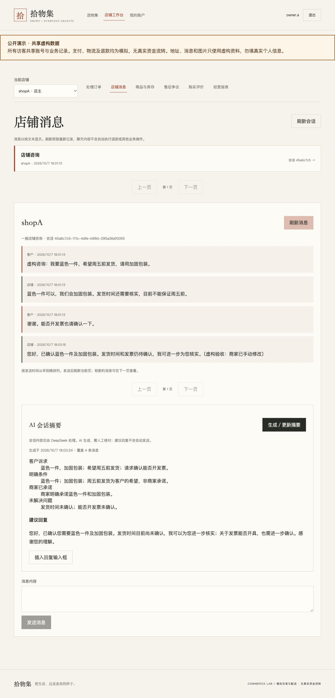
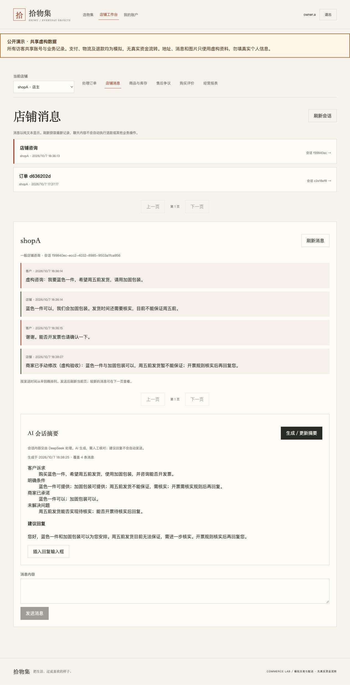

# 商家会话摘要与建议回复验证

日期：2026-10-07。候选 `codex/commerce-conversation-ai`，依赖公开演示部署候选；不合并main。
本轮仅商家手动生成DeepSeek中文摘要与回复草稿。AI没有业务工具，不自动发送。

## 供应商和实际浏览器

使用真实 `deepseek-flash`，不是模拟成功。虚构样本包含：客户希望与商家承诺区别、
多要求与更正/拒绝、明确包装承诺和未答复开票、消息内恶意指令与联系方式、
33条长对话的首尾要求与后续确认。完整五组均成功，9次供应商HTTP调用，
实际23197tokens。随后补强无承诺分类，单组复核成功，613tokens：
客户希望周五前发货，商家只说核实库存时，承诺字段为“未明确承诺”。

评估过程中曾发现草稿额外承诺发货、分段合并保留已解决事项，以及无关背景分段
空来源引用被拒绝。最终加入条件语气/角色区分/时间顺序合并约束，并允许空引用但
禁止跨快照引用。最终长对话保留“不要放价格标签”的明确承诺，未解决项只剩保修。
人工核对上述实际输出；这组样本不是对所有未来生成正确率的保证。

独立PostgreSQL生产配置schema提供真实HTTP/浏览器验收：

1. 三条虚构客户/商家消息；商家点击生成，页面显示摘要和覆盖3条。
2. 点击插入草稿只填写现有输入框，未增加消息；人工修改，点击原发送按钮才新增第四条。
3. 旧摘要显示待更新；手动更新后覆盖4条并消除陈旧标记。
4. 重启同一数据库的后端，摘要及修改后的消息保留；复用缓存不新增模型调用，保留原生成时间。
5. 客户和DEMO请求商家AI接口403，其他店铺商家404。

该会话两次实际生成共1405tokens。新的缓存请求保留独立尝试记录，usage为空；
不能将缓存记录看成实际模型调用。验收记录不包含密钥或会话令牌。

## 数据库、权限与回归

0009为新增表迁移，0001—0008未改写。本机38张原业务表的150条记录，在升级前后
按行数和完整内容指纹核对保持一致；本机迁移头为0009，共58张表。

新增真实PostgreSQL测试覆盖：持久化、来源范围、客户/DEMO/他店拒绝、生成后权限复核、
幂等与缓存绑定、新消息陈旧、失败保留旧结果及分段用量、并发、过期租约、升级保留、
跨重启账户/全局限流。独立质量审查发现缓存写入绕过限流；新增回归先失败，再修复为
所有新幂等键请求（包括缓存）受账户3次/分钟、全局20次/分钟限制，原键重放不新增行。
25个超额缓存请求均429；其他商家仍可正常生成，全局限制也覆盖新的缓存请求。

11项供应商适配测试包含独立真实HTTP服务上的401/402/429、空/非法结构、截断、
超大响应和实际socket超时，检查安全错误及已返回用量保留。模拟HTTP服务不是DeepSeek
真实供应商验收；上面的实际调用单独记录。

本轮已执行前端23项测试、lint、typecheck/build；脚本9项unittest；
后端Ruff/format104文件及脚本Ruff/format通过。前端新自动测试主要验证客户端请求意图，
实际插入/修改/发送交互由上述浏览器验收覆盖。源码扫描未发现提供的真实API Key。

最终完整后端回归：`pytest -m "not integration" -q`，真实隔离PostgreSQL，
**421通过、35项旧可选Sandbox集成测试deselected，333.57秒**。没有把未运行的
Sandbox测试称为通过；新的AI真实HTTP和数据库测试均在通过项中。
早期混合版本的两个元数据/API清单失败已修复，最终完整重跑确认无回归。

## 公开发布与云端验收

用户明确授权保存API凭据到现有Render服务并发布。2026-10-07 18:36（UTC+8），
Render部署 `aa235610063581dc9843b88abbf624aebdc91b3f` 显示Live；仍为Free实例、
自动部署关闭，分支为 `codex/commerce-conversation-ai`，不合并main。
公开网址：<https://fde-commerce-demo.onrender.com/>。密钥只保存后端私密环境。
该源码提交的push与PR共10项GitHub检查全部成功，包括真实数据库与生产容器验收。

云端真实HTTP和浏览器：本店商家可生成；客户/DEMO403、他店404。
三条虚构消息生成中文摘要与建议回复；插入只填草稿，人工修改并明确发送后新增第四条。
旧摘要标记待更新；更新覆盖4条。页面和独立HTTP读取均得到持久化结果；
缓存使用独立尝试记录、usage为空，并保持原成功结果和生成时间。
真实模型为 `deepseek-flash`；最后一次实际生成用量817tokens。

原云端验收的已完成订单仍为COMPLETED/PAID、1000分，当前商品图片可读取。
旧验收收据中的图片URL返回404，当前商品关联的是另一张图片；本轮没有修改或删除商品
图片，不能将旧图片的保留称为已通过，也没有据此推断丢失原因。
0009云端功能已可写入和读回；不把本机38表完整指纹验证当成云端全库指纹验证。

本轮点击服务Restart后，部署事件没有提供足以确认新进程启动的证据，因此公网重启
持久化不计为完成项。为明确验证容器替换而追加同版本重新部署，被自动审批以
避免不必要服务中断为由拒绝；未绕过。独立本机同库重启验收已通过，公网保存和缓存
读回已通过，当前已上线实例保持可用。
Render/Neon仍为免费服务，AI月预算无固定金额上限；没有升级网站资源。
