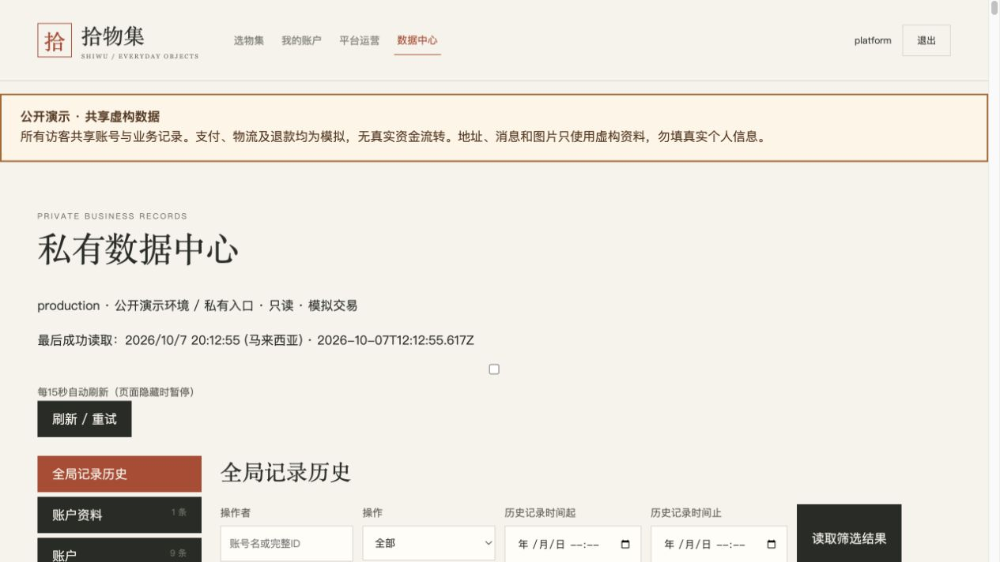

# 私有数据中心验证

日期：2026-10-07。候选 `codex/commerce-data-center`，依赖 `codex/commerce-conversation-ai`。
用户批准私有、只读、可选每15秒刷新，原数据库/订单保留，不合并main。

## 已实现范围

37类允许资源：36类业务记录和AI尝试。中文目录与字段、数量、关键词/状态/创建时间
筛选、稳定分页、当前记录、更新时间、父对象/子明细关联、全局与单条修改历史。
后端五个GET接口使用现有私有platform资格、只读事务、3秒查询超时，固定表/字段注册，
参数化筛选。禁止会话/验证表、凭据、图片二进制及任意SQL；历史也按允许字段再次投影。

自动刷新默认关闭；开启后15秒一次，页面隐藏时暂停。在途读取串行，快速切换只保留
最新查询，旧结果不显示在新资源下；React StrictMode清理后可重新建立读取。
页面最后成功读取时间只在成功后更新。原业务仍通过客户/商家功能修改。

BASELINE为升级当时状态，不是更早版本；删除记录可经历史查看。AI尝试保留自己的
状态/结果/用量，不宣称拥有业务行的全版本历史。本机和云端是独立数据库。

## 真实本机HTTP验收

原本机PostgreSQL和API恢复后，独立HTTP脚本读取全部37资源。
匿名401；customer.a、owner.a、owner.b、staff.a、demo、dual.a均403；会话表404；
超额limit400；SQL注入关键词只被作为参数查询，不执行。

通过原商家API新增虚构DRAFT商品（库存0），读取当前状态；再修改这条新商品标题和
说明。数据API返回实际新标题、不同的updated_at；历史UPDATE的before/after与实际修改
一致，操作者owner.a、数据库记录时间明确。本轮未修改已有订单或商品。
本机受保护登录说明保存在本机私密临时文件，不加入Git或公开截图。

重启原本机API后再次读取全部37资源，新商品及其历史仍保留；SKU指向准确的商品主键，
商品子明细使用product_id精确筛选。原数据库4条订单保留，无迁移或数据库重置。

## 验收限制与发布

实际浏览器操作被安全检查阻止：管理员强制策略验证服务不可用，工具无法确认访问许可。
同一localhost目标稍后重试仍被阻止；未使用其他浏览器自动化、代理或关闭安全控制绕过。
因此页面实际点击、自动刷新实际视觉结果和截图不计为通过；自动测试与HTTP证据单独记录。

本机前端5179与后端18008已启动，公网暂时保留已上线AI版本。本轮没有操作Render发布，
没有保存或更改云端私密凭据，没有升级免费托管资源。需浏览器检查恢复并完成页面验收后
才能将这一候选发布到现有公开演示站。

## 自动测试和审查

最终前端30项测试通过，lint、TypeScript与Vite构建通过。Ruff检查和107个Python文件
格式检查通过，diff whitespace检查通过。新增6项隔离schema真实PostgreSQL测试通过。
关联元数据回归覆盖有记录的资源，空资源不作为实际记录跳转验收。
独立规格审查及代码质量审查均通过；发现的筛选残留、复合外键链接和读取生命周期
问题已修复。候选与跟踪文件共265个的私密模型凭据扫描无匹配。

最终完整后端回归：427 passed、35 deselected，408.97秒。命令为
`python /private/tmp/fde-shopping-target.py -m "not integration" -q`。
35项可选旧Sandbox外部集成未运行，不计为本轮接受；一项已有Starlette依赖弃用警告。
前端命令为`npm test`、`npm run lint`、`npm run build`；Python检查为Ruff check与format check。
文档本地链接及diff whitespace检查通过。

## 2026-10-07 公开发布补充

用户明确请求公开发布并重启Codex后，浏览器策略验证恢复。本机真实页面已验证私有登录、
37类目录、商品关键词筛选、真实INSERT/UPDATE前后历史、商品到规格关联跳转。
一轮瞬时Failed to fetch后，页面显式重试成功，错误未被当作新鲜数据。默认刷新关闭；
开启后成功读取时间自动推进，随后关闭。没有因验收修改已有业务行。

Render指定源码提交`08d0edbe4e3741b4da6deb3f09a574589eeabd08`，部署
`dep-db33col9fdbs739rc52g`于20:09（UTC+8）开始，1m33s后显示Deploy succeeded / Live。
使用Deploy a specific commit（any branch）；服务追踪分支仍为codex/commerce-conversation-ai，
自动部署未开启，无main合并，无免费计划升级，无数据库/私有凭据变更。

公网真实HTTP：私有platform资格通过；匿名401、六类共享账号403；全部37类允许资源可读，
无password_hash/token_digest；production/public_demo/只读标识正确；全局历史可读。
旧验收订单仍COMPLETED/PAID、1000分，旧会话AI尝试仍存在。没有发起新的计费模型生成。
公网浏览器刷新新版本后私有登录成功，数据中心目录、云端订单和AI尝试数量显示。
该源码提交GitHub push/PR十项检查均通过，包括真实数据库与生产容器。
公开地址：https://fde-commerce-demo.onrender.com/ 。本机数据库与云端数据库仍独立。

公网全局历史页面读取成功，最后成功读取时间推进至20:12:55（UTC+8）。

